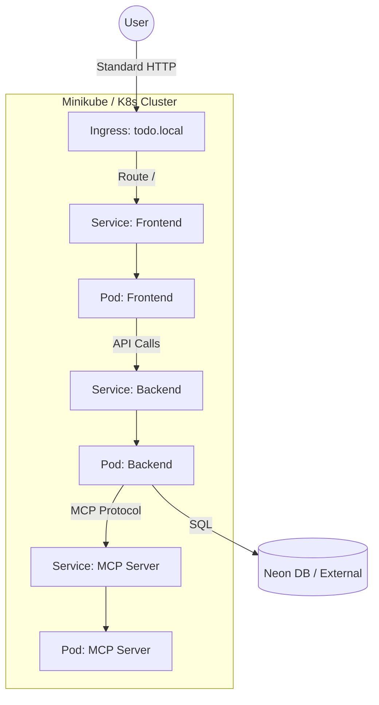

# Data Model: Phase 4 Local Kubernetes Deployment

**Status**: Draft
**Date**: 2026-01-11

## Overview

For this infrastructure phase, the "Data Model" consists of the Kubernetes resources and their relationships. These entities define the desired state of the application in the cluster.

## Infrastructure Entities

### 1. Core Namespaces
| Entity | Name | Description |
|--------|------|-------------|
| Namespace | `todo-app` | Isolated environment for all Todo application components. |

### 2. Workloads (Deployments)
| Entity | Component | Replicas | Image Source | Configuration |
|--------|-----------|----------|--------------|---------------|
| Deployment | `todo-frontend` | 2 | `todo-frontend:latest` | Env vars from ConfigMap/Secret |
| Deployment | `todo-backend` | 2 | `todo-backend:latest` | Env vars, connection strings |
| Deployment | `todo-mcp-server` | 1 | `todo-mcp-server:latest` | Context-dependent config |

### 3. Networking (Services & Ingress)
| Entity | Type | Target | Port | Description |
|--------|------|--------|------|-------------|
| Service | NodePort (Dev) / LoadBalancer (Prod) | `todo-frontend` | 3000 | Exposes frontend internally/externally |
| Service | ClusterIP | `todo-backend` | 8000 | Internal backend API access |
| Service | ClusterIP | `todo-mcp-server` | 8001 | Internal MCP server access |
| Ingress | Nginx Ingress | `todo-frontend` | 80 | Routes `todo.local` traffic to frontend service |

### 4. Configuration & State
| Entity | Name | Scope | Description |
|--------|------|-------|-------------|
| ConfigMap | `todo-config` | Global | Non-sensitive env vars (API URLs, Feature flags) |
| Secret | `todo-secrets` | Global | Sensitive data (DB URL, API Keys) |
| PersistentVolumeClaim | `postgres-pvc` | DB | (If running local DB pod) Storage persistence |

## Entity Relationships



## Helm Chart Structure (Data Schema)
The Helm `values.yaml` serves as the schema for deployment configuration.

```yaml
global:
  environment: "development"

frontend:
  replicaCount: 2
  image:
    repository: todo-frontend
    tag: latest

backend:
  replicaCount: 2
  image:
    repository: todo-backend
    tag: latest

mcp:
  replicaCount: 1
```
