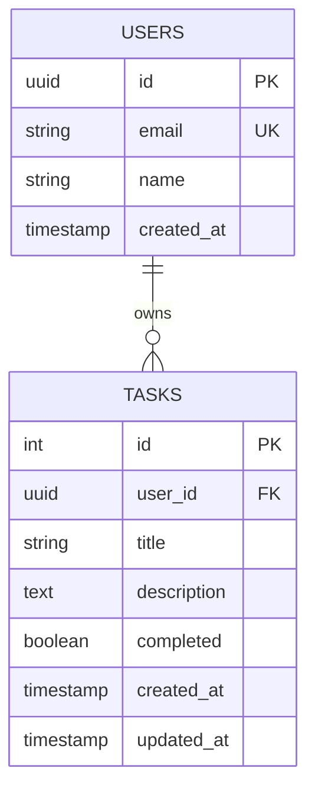

# Data Model: Todo Web Application

**Feature**: Todo Full-Stack Web Application
**Version**: 1.0.0
**Date**: 2025-12-26

---

## Entities

### User

**Source**: Better Auth (external provider)

| Field | Type | Constraints | Description |
|-------|------|-------------|-------------|
| id | string | UUID, Primary Key | Unique user identifier (from Better Auth) |
| email | string | Unique, max 255 | User email address |
| name | string | max 255 | Display name |
| created_at | timestamp | Not Null | Account creation timestamp |

**Relationships**:
- `tasks`: One-to-many with Task (user_id foreign key)

### Task

| Field | Type | Constraints | Description |
|-------|------|-------------|-------------|
| id | integer | Primary Key, Auto-increment | Unique task identifier |
| user_id | string | Foreign Key → users.id, Indexed | Owner of the task |
| title | string | Not Null, max 200 | Task title |
| description | text | Nullable, max 1000 | Task details |
| completed | boolean | Default: false | Completion status |
| created_at | timestamp | Not Null | Creation timestamp |
| updated_at | timestamp | Not Null | Last modification timestamp |

**Relationships**:
- `user`: Many-to-one with User (via user_id foreign key)

---

## Validation Rules

### User Validation
- Email must be valid format
- Email must be unique
- Name is required

### Task Validation
- Title is required, max 200 characters
- Description is optional, max 1000 characters
- User_id must reference an existing user
- Timestamps are auto-generated

---

## State Transitions

```
Task State Machine:

created → active → completed
                ↘ archived

- created: Initial state when task is first created
- active: Normal state for incomplete tasks
- completed: When user toggles completion
- archived: Optional future state (not in Phase 2)
```

---

## Database Indexes

| Index | Columns | Type | Purpose |
|-------|---------|------|---------|
| idx_tasks_user_id | user_id | B-tree | Filter tasks by user |
| idx_tasks_completed | completed | B-tree | Filter by completion status |
| idx_tasks_created_at | created_at DESC | B-tree | Sort by creation date |

---

## Schema Diagram



---

## TypeScript Interfaces

```typescript
interface User {
  id: string;
  email: string;
  name: string;
  createdAt: Date;
}

interface Task {
  id: number;
  userId: string;
  title: string;
  description?: string;
  completed: boolean;
  createdAt: Date;
  updatedAt: Date;
}

interface TaskCreate {
  title: string;
  description?: string;
}

interface TaskUpdate {
  title?: string;
  description?: string;
  completed?: boolean;
}
```

## Pydantic Models (Backend)

```python
from sqlmodel import SQLModel, Field, Relationship
from datetime import datetime
from typing import Optional
from pydantic import EmailStr

class User(SQLModel, table=True):
    __tablename__ = "users"

    id: str = Field(primary_key=True, max_length=255)
    email: str = Field(unique=True, max_length=255)
    name: str = Field(max_length=255)
    created_at: datetime = Field(default_factory=datetime.utcnow)

    tasks: list["Task"] = Relationship(back_populates="user")

class Task(SQLModel, table=True):
    __tablename__ = "tasks"

    id: int | None = Field(default=None, primary_key=True)
    user_id: str = Field(foreign_key="users.id", index=True)
    title: str = Field(max_length=200)
    description: str | None = Field(default=None, max_length=1000)
    completed: bool = Field(default=False)
    created_at: datetime = Field(default_factory=datetime.utcnow)
    updated_at: datetime = Field(default_factory=datetime.utcnow)

    user: User = Relationship(back_populates="tasks")
```

---

*Generated with Spec-Kit Plus*
*Version*: 1.0.0
*Date*: 2025-12-26
